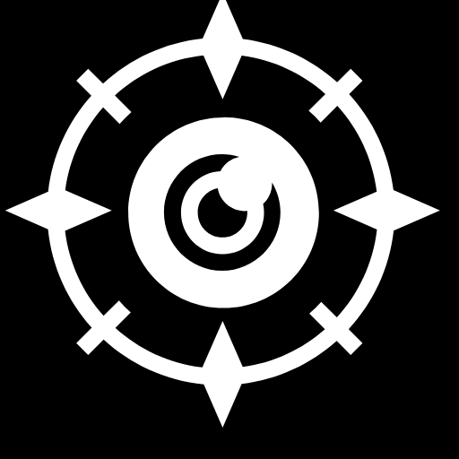
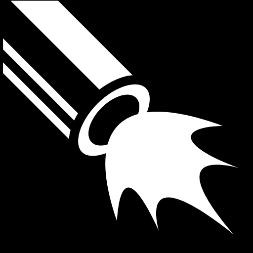
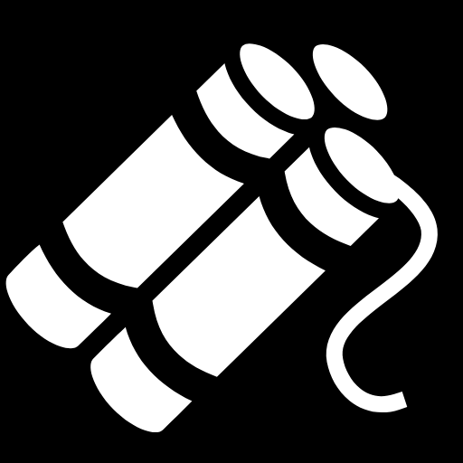
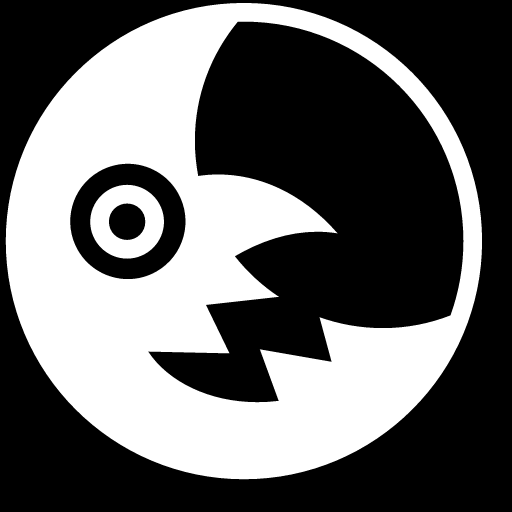

# {{ page.title }}
{{ page.attack_type }} {{ page.attribute }} Hero

---
## Lore
asdf

## Appearance
asdf

---
## Stats

| **Primary Attribute**         | {{ page.attribute }} |
| **Movement Speed**            | 285 |
| **Base Damage** (at Level 1)  | 55 - 61 |
| **Attack Type**               | {{ page.attack_type }} |
| **Attack Range**              | 625 |
| **Projectile Speed**          | 1200 |

| :- | :- | :- | :- |
| **Strength**      | 18 + 2.2  | **Health Regen**       | 0.0 |
| **Agility**       | 24 + 2.9  | **BAT**                | 1.9 |
| **Intelligence**  | 20 + 1.8  | **Armor** (at Level 1) | 2.0 |

---
## Abilities

### (Q) Deadeye

Target Point Active

Fire a round with deadly precision in the target direction, performing an instant attack with bonus damage on the first enemy unit it hits.
If the round encounters a tree, cliff, building, or firebomb (your E), it will ricochet, increasing the bonus damage each time it does so.
If the round ricochets at least once, it will also stun the victim.

The round travels up to 2500 distance or until it hits a unit.
Destroys trees it bounces on.
The effect is instant (no visible projectile).

Has 7 charges.  Charges do not recover over time.  You must use your Reload (D) ability to recover charges.
Has a brief cast point and cooldown.

### (D) Reload (SUB-ABILITY)

No Target Active

You can activate this ability and channel briefly to recover all bullet charges (7 max).
Any attack that consumes the first or last bullet charge will deal a guaranteed critical hit.

---
### (F) Fan the Hammer (SUB-ABILITY)

Target Point Active

Quickly consume all charges of Deadeye, firing in the target direction.
Each firing is randomly displaced slightly from the cast point (so they don't fire in the exact same place).
There is a small delay between shots, but is still much faster than manually casting.

-------------------------
### (W) Showdown

Target Unit Active

The Gunslinger challenges the target unit to a shootout, creating a circular arena centered around them.
They both deal bonus damage as long as they remain inside, but are silenced and slowed as long as they remain outside.
If either dies while affected by Showdown, the survivor receives bonus gold and the effect ends.
If both are outside the arena, the effect ends.

The AOE is fairly large (closer to Mars arena than Puck coil).

-------------------------
### (E) Ace in the Hole

Target Point Active

Toss a bundle of dynamite at the target point, which explodes after a short duration or when destroyed.
Enemies caught in the blast are knocked back, and take magic damage and a slowing DoT effect (effect decreases with distance from blast center).
The Gunslinger is also knocked back if caught in the blast (doesn't affect allies otherwise).

Has a flat amount of HP, no magic resistance.
Can be attacked by allies but ally attacks always take 3 hits to kill, unless it is hit by Deadeye (Q), in which case it always explodes instantly.

Deadeye can ricochet off the firebomb.
The firebomb will never be attacked by creeps or towers (like ET sleep victims).

-------------------------
### (R) Witching Hour

No Target Active

The Gunslinger mounts up and summons the gang for a mounted night raid.

On activation, it becomes night, the Gunslinger gains significant bonus movespeed, and then summons Night Riders: uncontrollable, fast-moving ranged units that follow and mimic the Gunslinger.
When the Gunslinger attacks a unit or casts Deadeye (or its subabilities), his Night Riders will also attack or cast at the same unit or point.

Witching Hour ends immediately if the Gunslinger is killed (this is considered a transformation effect).
Night Riders are targetable units and can be killed by enemies.
Night Riders have flying movement and will follow the Gunslinger, circling him randomly when they catch up.
Night Riders have fixed stats and don't scale with items.
Night Riders have a random, short delay before they mimic the Gunslinger, and don't mimic it at exactly the same point.
Night Riders will also mimic Reload (though they technically don't need charges to mimic Deadeye or Fan the Hammer).

Summons 1/2/3 Night Riders.

-------------------------
## Scepter Upgrade
Improved Witching Hour

Night Riders now also mimic Ace in the Hole (E), throwing firebombs near the same point the Gunslinger does with a random short delay.

-------------------------
## Shard Upgrade
Improved Reload

Can now move while reloading and cannot be interrupted (no longer channelling).
Increases guaranteed critical damage.
